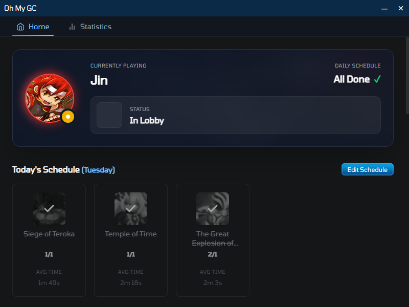
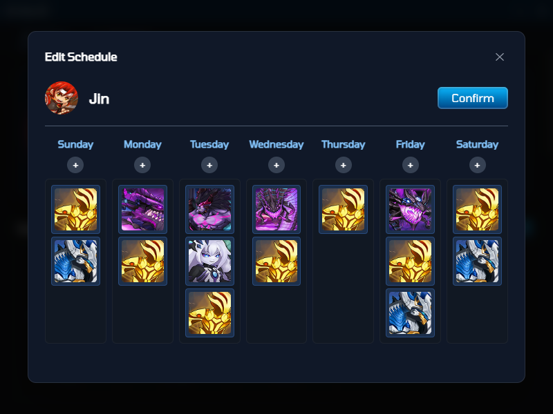
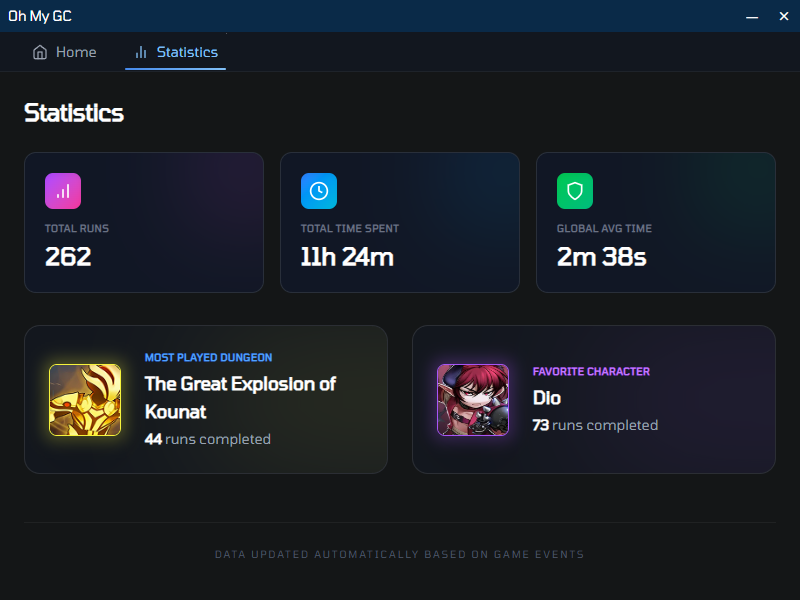

  

# Oh My GC

**Oh My GC** is an intelligent tracker for Grand Chase that automates character discovery and dungeon tracking. Built to help players optimize their gameplay by tracking runs, characters, and statistics automatically.

## Features

- **Automatic Character Detection**: Detects which character you're playing in real-time
- **Dungeon Tracking**: Automatically tracks which dungeons you run
- **Run Statistics**: Keeps detailed statistics of your gameplay
- **Schedule Builder**: Plan and organize your dungeon runs

## Demo

Watch it in action:

https://github.com/user-attachments/assets/866b2cdf-e97f-49a9-a0cb-7fb8914d32ae

## Installation

### Windows

1. Download the latest installer from the [Releases](https://github.com/vinicius98s/oh-my-gc/releases) page
2. Run the `.exe` installer
3. Launch the application from your desktop or Start menu

### Building from Source

See [CONTRIBUTING.md](CONTRIBUTING.md) for detailed build instructions.

## How to Use

1. **Launch the Application**: Start Oh My GC and complete the onboarding setup
2. **Start Grand Chase**: Launch the Grand Chase game client
3. **Begin Tracking**: The app will automatically detect your character and dungeons as you play
4. **View Statistics**: Check the Statistics page to see your gameplay data
5. **Plan Runs**: Use the Schedule Builder to organize your dungeon runs

## FAQ

How does it work?

We take screenshots of the game and use image recognition to detect which character or dungeon you're playing.

Does this modify the game in any way?

No, it doesn't modify the game in any way.

How can I uninstall?

To uninstall Oh My GC on Windows:
- Go to Control Panel > Uninstall a program
- Find "Oh My GC" in the list
- Click Uninstall

The app is not detecting game changes

Try to run the game with a 16:9 resolution. Ideally, the resolution should be 1920x1080.
Other resolutions haven't been tested.

What else do you plan to add?

Currently, I have plans to add:

- A game overlay
- An equipment progress helper
- A rewards tracker

## Screenshots

### Home Page

The home screen provides quick access to all main features, including today's schedule and quick actions.

### Schedule Builder

Plan and organize your dungeon runs with the intuitive schedule builder interface.

### Statistics

View detailed statistics about your gameplay, including run counts, character usage, and more.

## Support

- **Issues**: Report bugs or request features on [GitHub Issues](https://github.com/vinicius98s/oh-my-gc/issues)

## Contributing

We welcome contributions! Please see our [CONTRIBUTING.md](CONTRIBUTING.md) for guidelines on how to contribute to the project.

---
